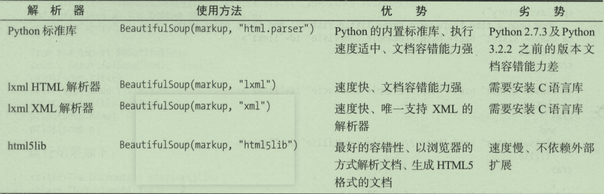

Beautiful Soup让我们可以利用网页的结构和属性等特性来解析网页  
## 准备工作
安装Beautiful Soup，lxml  

## 解析器
  

## 基本用法

```python
from bs4 import BeautifulSoup

#html text
html = '''
'''

soup = BeautifulSoup(html,'lxml')
print(soup.prettify())
print(soup.title.string)
```

## 节点选择器

- 选择元素
```python
from bs4 import BeautifulSoup

#html text
html = '''
'''

soup = BeautifulSoup(html,'lxml')
print(soup.title.string)
print(type(soup.title))
print(soup.title.string)
print(soup.head)
print(soup.p)
```
这种选择方式只能选择匹配的第一个元素  

- 提取信息

    - 获取名称
    利用name属性获取节点名称
    - 获取属性
    利用attrs获取节点所有属性
    - 获取内容
    利用string属性获取元素节点的文本内容

- 嵌套选择

选择的节点里还有子节点时，可以嵌套选择  

- 关联选择
  - 子节点和子孙节点
  利用节点的contents属性可以获得其直接子节点
  children属性和contents属性差不多
  descendants属性可以获得所有子孙节点
  - 父节点和祖先节点
  parent属性获取节点的直接父节点
  parents属性获取节点祖先节点
  - 兄弟节点
  next_sibling previous_sibling next_siblings previous_siblings
  - 提取信息
  选取节点后，利用string，attrs等属性获取信息，和前面介绍相同

## 方法选择器

- find_all()
  find_all(name,attrs,recursive,text,**kargs)
- find()
- find_parents() find_parent()
- find_next_siblings() find_next_sibling()
- find_previous_siblings() find_previous_sibling()
- find_all_next() find_next()
- find_all_previous() find_previous()

## CSS选择器

使用CSS选择器时，只用使用select()方法，传入响应CSS选择器即可  
- 嵌套选择
- 获取属性
  ``` python
  from bs4 import BeautifulSoup
  soup = BeautifulSoup(html,'lxml')
  for ul in soup.select('ul'):
      print(ul['id'])
      print(ul.attrs['id'])
  ```
- 获取文本
  ``` python
  from bs4 import BeautifulSoup

  soup = BeautifulSoup(html,'lxml')
  for li in soup.select('li'):
      print("Get Text:",li.get_text())
      print("String:",li.string)
  ```